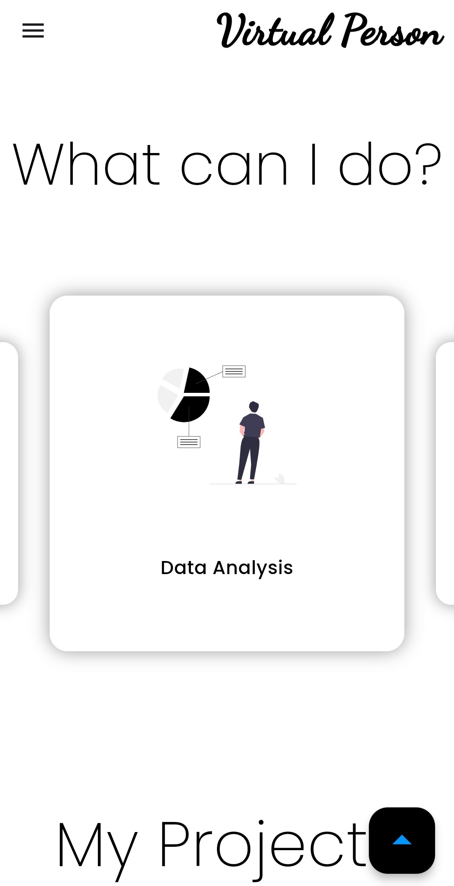

## Table of Contents 🌟

- [Introduction](#introduction-) 🏛️
- [Demo](#demo-) 🎬
- [Features](#features-) 🌟
- [Screenshots](#screenshots-) 📸
- [Packages Used](#packages-used-) 📚
- [Author](#author) 👩‍💻

---

<!-- Introduction Section -->

## Introduction 🏛️

Welcome to our Portfolio Showcase, a vibrant platform designed to highlight our educational background, professional experiences, skills, services, projects, and contact information. This showcase, powered by Flutter, embodies the modern art of application development, blending functionality with aesthetics to create a seamless user experience.

Whether you're exploring our projects, interested in our services, or simply browsing, we're thrilled to share our journey with you.

---

<!-- Demo Section -->

## Demo 🎬

---

<!-- Features Section -->

## Features 🌟

- Responsive & Adaptive UI
- Clean Architecture
- Light & Dark Theme

---

<!-- Screenshots Section -->

## Screenshots 📸

---

<!-- Packages Used Section -->

## Packages Used 📚

The app utilizes several packages to enhance its functionality. Some of the key packages used include:

- [carousel_slider](https://pub.dev/packages/carousel_slider)
- [cupertino_icons](https://pub.dev/packages/cupertino_icons)
- [expandable_page_view](https://pub.dev/packages/expandable_page_view)
- [flip_card](https://pub.dev/packages/flip_card)
- [flutter_svg](https://pub.dev/packages/flutter_svg)
- [font_awesome_flutter](https://pub.dev/packages/font_awesome_flutter)
- [icons_launcher](https://pub.dev/packages/icons_launcher)
- [url_launcher](https://pub.dev/packages/url_launcher)
- [window_manager](https://pub.dev/packages/window_manager)

These packages are crucial for enabling various functionalities and enhancing the app's capabilities.

---

<!-- Author Section -->

## Author 👩‍💻

**About Us:**
- **Names:** Sirine Dhouib & Mariem Sfaxi
- **Connect with Us:**
  - Email: sirinedhouib000@gmail.com, mariemsfaxi10@gmail.com

Feel free to reach out if you have any questions, suggestions, or just want to say hello!

---

<!-- Add a line of colorful separation for style -->

  

